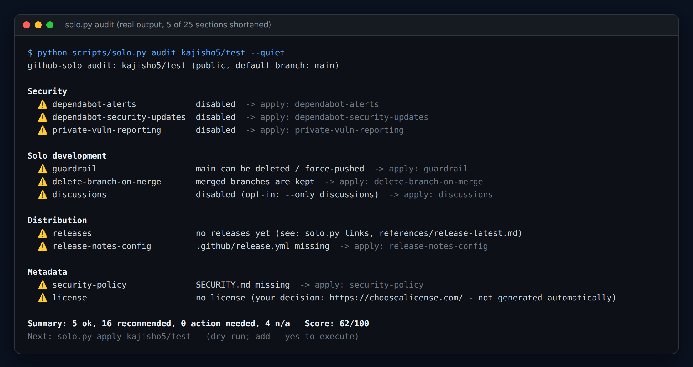
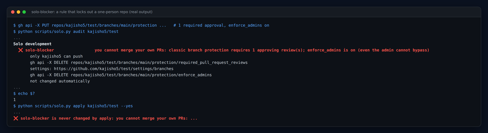
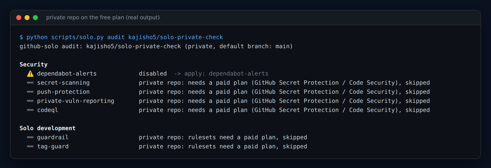
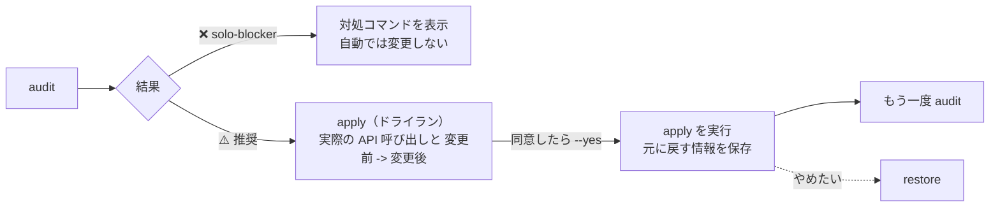
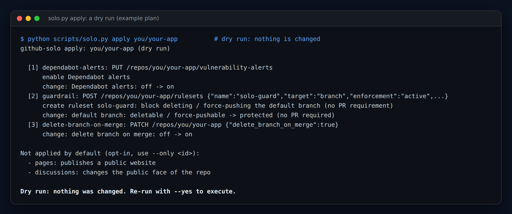

<p align="center">
  
</p>

<h1 align="center">github-solo-skill</h1>

<p align="center"><strong>1人開発のリポジトリ向けの GitHub 設定チェック。自分の PR がマージできなくなる設定は絶対に入れません。</strong></p>

<p align="center">
  診断 · 安全な自動設定 · 無料機能のみ · <code>restore</code> で元に戻せる · Python 標準ライブラリのみ<br>
  Claude Code · Codex · Cursor · Copilot · <code>SKILL.md</code> / <code>AGENTS.md</code> を読む、または MCP に対応するエージェント
</p>

<p align="center">
  <a href="https://github.com/kajisho5/github-solo-skill/actions/workflows/test.yml"></a>
  <a href="https://github.com/kajisho5/github-solo-skill/stargazers"></a>
  <a href="https://github.com/kajisho5/github-solo-skill/commits/main"></a>
  
  
  <a href="LICENSE"></a>
  <a href="https://github.com/sponsors/kajisho5"></a>
</p>

```bash
npx skills add kajisho5/github-solo-skill
```

[English](README.md) · 日本語

<p align="center"></p>

<p align="center"><sub>使い捨てリポジトリに対する実際の出力（一部の項目は省略）。エージェントに「リポジトリの設定を確認して」と頼むか、<code>python3 scripts/solo.py audit OWNER/REPO</code> を実行します。</sub></p>

## 30秒で使う

```bash
python3 scripts/solo.py audit OWNER/REPO          # 1. 何が足りない？（終了コード 1 は ❌ があるときだけ）
python3 scripts/solo.py apply OWNER/REPO          # 2. 何が変わる？（ドライラン。何も書き込まない）
python3 scripts/solo.py apply OWNER/REPO --yes    # 3. 実行（外から見えず、戻せる項目だけ）
python3 scripts/solo.py restore OWNER/REPO --yes  # 4. やめたい？ 元に戻す
```

公開面に関わる項目（Pages、Discussions、topics など）は、名指しした場合だけ適用します：`apply --yes --only pages`

## なぜ作ったか

チーム向けの GitHub 設定 skill（例：`netresearch/github-project-skill`）は、**承認必須**のブランチ保護を入れます。
CODEOWNERS レビュー必須や `enforce_admins` も付くことがあります。メンテナが自分1人だと承認できる人がいないので、**自分の PR をマージできなくなります**。

`github-solo` は逆の原則で作っています。そういうリポジトリに出会ったときの動き（実際の出力）：

<p align="center"></p>

| | チーム向け skill | github-solo |
|---|---|---|
| 承認必須 / CODEOWNERS レビュー必須 / `enforce_admins` | 追加する | **絶対に追加しない**。コミッターが自分だけのリポに既にあれば ❌ として検出し、外すコマンドを提示（自動では変更しない） |
| デフォルトブランチの保護 | PR 必須 | ruleset `solo-guard`：削除と force push のみ禁止。直接 push も自分でのマージも今まで通り |
| 有料機能 | 前提にする | 無料機能のみ。private リポの有料項目は ➖ で理由を表示してスキップ（下記） |
| `apply` がデフォルトで変えるもの | 全部 | 外から見えず、すぐ戻せる項目だけ。公開面とワークフローへの影響があるものは `--only` が必要 |
| 既存のファイル・設定 | 上書きされうる | 削除も上書きもしない |
| 間違えたとき | 手で直す | `restore` が直前の `apply --yes` の変更だけを元に戻す |

背景の詳細：[docs/why-solo.md](docs/why-solo.md)（英語）

<p align="center"></p>

## 動き方



<p align="center"></p>

## チェック項目（26個）

各項目の API と戻し方：[references/checks.md](references/checks.md)、または `solo.py explain CHECK_ID`

| カテゴリ | チェック（apply id） | `apply` |
|---|---|---|
| **セキュリティ** | `dependabot-alerts`、`dependabot-security-updates` | デフォルト |
| | `secret-scanning`、`push-protection`、`private-vuln-reporting`、`codeql`（public リポ） | デフォルト |
| | `dependabot-config`：検出したエコシステムから `.github/dependabot.yml` を生成（monthly、エコシステムごとに1 PR へ集約）。既存ファイルは比較のみ | デフォルト |
| | `actions-pinning`：ワークフローの action が SHA 固定か | 報告のみ |
| | `workflow-permissions`：`GITHUB_TOKEN` のデフォルトを read に | **opt-in** |
| **1人開発** | `solo-blocker`：1人のリポを詰ませる承認必須ルール | ❌ 検出のみ |
| | `guardrail`：ruleset `solo-guard`（デフォルトブランチの削除・force push 禁止。PR 要件なし） | デフォルト |
| | `tag-guard`：`v*` タグ用の ruleset `solo-tag-guard` | **opt-in** |
| | `delete-branch-on-merge` | デフォルト |
| | `discussions` | **opt-in** |
| **配布** | `pages`（公開フォルダを自動判定、homepage も設定） | **opt-in** |
| | `releases`：リリースの有無、ダウンロードできるアセットがある latest、アセット名にバージョンが入っていないか | 報告のみ |
| | `release-workflow`：デフォルトブランチへの push でリリースが走らないか | 報告のみ |
| | `release-tag-format`：最新のタグが素直な `vX.Y.Z` か（release-please は既定でパッケージ名が付く） | 報告のみ |
| | `release-notes-config`：`.github/release.yml` | デフォルト |
| **メタ情報** | `security-policy`：private vulnerability reporting へ案内する `SECURITY.md` | デフォルト |
| | `description`、`license`（自動生成しない）、`social-preview`（API 不可） | 報告のみ |
| | `topics`（`--topics a,b`）、`labels`（`release.yml` 用）、`community-files`（Issue / PR テンプレート、CONTRIBUTING） | **opt-in** |

**private リポ：** GitHub Secret Protection / Code Security は有料なので、`secret-scanning`・`push-protection`・`private-vuln-reporting`・`codeql` は理由付きの ➖ です。ruleset も有料プランが必要なので `guardrail` / `tag-guard` も ➖ です。Dependabot の alerts と updates は無料なので適用します。

**「push でリリースが走る」警告：** デフォルトブランチへの push で動き、**かつ**リリースを作りそうなワークフロー（`gh release create`、`softprops/action-gh-release`、`release-please`、`contents: write` など。呼び出される再利用ワークフローも対象）を検出すると、`apply` はファイルを書く前に警告します。`--commit-files` は `--accept-release-risk` を付けない限り拒否されます。検出はテキストベースの簡易判定です。

## コマンド

| コマンド | 内容 |
|---|---|
| `audit [OWNER/REPO] [--json] [--quiet] [--ignore ids] [--fail-on warn] [--profile app\|library\|site\|docs] [--github-annotations]` | 診断。❌ があれば終了コード 1（`--fail-on warn` で ⚠️ でも 1）。0〜100 点のスコアも表示 |
| `audit --all-repos OWNER [--json]` | オーナーの全リポ（アーカイブ・fork 除く）を1行ずつ要約 |
| `apply [OWNER/REPO] [--yes] [--only ids] [--skip ids] [--pages-path / \| /docs] [--topics a,b] [--commit-files] [--accept-release-risk] [--json]` | ドライランで計画表示、`--yes` で実行 |
| `restore [OWNER/REPO] [--yes] [--snapshot FILE]` | 直前の `apply --yes` が変更した内容を元に戻す |
| `doctor [OWNER/REPO] [--json]` | 実行場所（クラウドコンテナ / PC 上の Claude Code / 通常のシェル）、トークンの出所（値は表示しない）、API への到達、各管理系エンドポイントへのアクセスを確認 |
| `links [OWNER/REPO] [--markdown]` | 最新版の固定ダウンロード URL（`/releases/latest/download/<asset>`）。使えない場合（Pre-release のみ、アセット名にバージョン入り）はその理由 |
| `links --workflow` | バージョン無しアセットも一緒にアップロードするリリースワークフローの雛形 |
| `dependabot [OWNER/REPO]` | `dependabot.yml` を生成して標準出力へ |
| `badges [OWNER/REPO]` | README 用バッジの Markdown |
| `explain CHECK_ID` | チェック1件の理由・API・戻し方（オフライン） |
| `ci-template` | 週1回の audit を行う GitHub Actions ワークフローの雛形 |

clone の中では `OWNER/REPO` を省略でき、`git remote origin` から推定します。`--lang ja`（または `SOLO_LANG=ja`、日本語の `$LANG`）でテキスト出力を日本語にします。`--json` は常に英語です。
GitHub Enterprise Server は `SOLO_API_BASE=https://HOST/api/v3` を指定します。使い方の例：[docs/recipes.md](docs/recipes.md)（英語）

### 生成ファイル

`dependabot.yml`、`release.yml`、`SECURITY.md`、コミュニティファイルは、存在しない場合だけ生成します。**clone の中**ではローカルに書き出すだけ（内容を確認してコミットしてください）。
`--commit-files` を付けると、Contents API でデフォルトブランチへ直接コミットします。既存のファイルには触りません。

## トークンの権限

トークンは `GH_TOKEN` → `GITHUB_TOKEN` → `gh auth token` の順で取得します。

- **classic PAT：** `repo`（public リポのみなら code scanning のエンドポイントは `public_repo` で足ります。他の管理系エンドポイントは `repo` として記載されています）。
- **fine-grained PAT**（Repository permissions、[GitHub ドキュメント](https://docs.github.com/en/rest/authentication/permissions-required-for-fine-grained-personal-access-tokens)より。エンドポイントごとの実測はしていません）：

| 権限 | レベル | 用途 |
|---|---|---|
| Metadata | Read | リポ情報、コラボレーター一覧 |
| Administration | Read and write | Dependabot、private vulnerability reporting、code scanning、rulesets、ブランチ保護（読み取り）、Actions の workflow 権限、リポ設定（`PATCH`） |
| Contents | Read（audit）/ Read and write（`--commit-files`） | git tree、ファイル取得、生成ファイルのコミット |
| Pages | Read and write | `--only pages` |

多くの設定にはリポの admin 権限が必要です。403/404 やプランの制限：[references/troubleshooting.md](references/troubleshooting.md)。うまくいかないときは、まず `solo.py doctor OWNER/REPO` を実行してください。

## インストール

```bash
# Skills CLI（Claude Code、Cursor、Codex など）
npx skills add kajisho5/github-solo-skill

# またはエージェントの skills ディレクトリへ clone
git clone https://github.com/kajisho5/github-solo-skill ~/.claude/skills/github-solo   # Claude Code
git clone https://github.com/kajisho5/github-solo-skill ~/.cursor/skills/github-solo   # Cursor
git clone https://github.com/kajisho5/github-solo-skill ~/.agents/skills/github-solo   # Codex（Cursor もここを読みます）
```

### 他の AI エージェント（Codex、Cursor、Copilot、Gemini CLI など）

| エージェント | 方法 |
|---|---|
| **Codex** | skill：`~/.agents/skills/github-solo`（ユーザー）または `<repo>/.agents/skills/github-solo`（リポジトリ）へ clone（[Codex skills ドキュメント](https://learn.chatgpt.com/docs/build-skills)）。MCP：`codex mcp add github-solo -- python3 /path/to/github-solo/scripts/solo_mcp.py`、または `~/.codex/config.toml` に `[mcp_servers.github-solo]`（`command`・`args`）（[ドキュメント](https://learn.chatgpt.com/docs/extend/mcp?surface=cli)）。`AGENTS.md` も読みます。**Codex デスクトップアプリ（Windows）：** *Settings → MCP servers → Add server → STDIO*、command に `python`、引数に `scripts\solo_mcp.py` のフルパス（ドキュメントでは CLI と `config.toml` を共有。Windows のパスは明記されておらず、アプリでは未検証）。 |
| **Claude Code** | skill（上記）、plugin（下記）、または MCP：`claude mcp add github-solo -- python3 /path/to/github-solo/scripts/solo_mcp.py` |
| **Cursor** | skills ディレクトリ `~/.cursor/skills/github-solo`（姉妹プロジェクト [ffmpeg-skill](https://github.com/kajisho5/ffmpeg-skill) の記載に従ったパス。`~/.agents/skills` も読みます）。Cursor 自身のドキュメントでは未確認です。 |
| **GitHub Copilot** | このリポジトリの `AGENTS.md` と `.github/copilot-instructions.md` を読みます（[ドキュメント](https://docs.github.com/en/copilot/how-tos/configure-custom-instructions/add-repository-instructions)）。 |
| **その他のエージェント** | MCP stdio サーバー `python3 scripts/solo_mcp.py`（ツール：`solo_doctor`、`solo_audit`、`solo_apply_plan`、`solo_apply`、`solo_restore`、`solo_links`、`solo_dependabot`、`solo_badges`、`solo_explain`）、または `python3 scripts/solo.py ...` を直接実行。エージェントには `AGENTS.md` を読ませてください。 |

MCP サーバーは [MCP stdio トランスポート](https://modelcontextprotocol.io/specification/2025-06-18/basic/transports)（改行区切りの JSON-RPC、プロトコル 2025-06-18 / 2025-03-26 / 2024-11-05）に従います。検証は自作のクライアントと Claude Code 自身のクライアント（`claude mcp list` で接続成功）で行いました。Codex と Cursor では試していません。`solo_apply` と `solo_restore` は `confirm` が `true` でない限り何も変更しません。

Claude Code plugin として（このリポジトリが marketplace を兼ねます）：

```bash
claude plugin marketplace add kajisho5/github-solo-skill
claude plugin install github-solo@github-solo-skill
```

エージェント無しでも `python3 scripts/solo.py --help` で使えます。clone は `git pull` で更新します。他のインストーラーが作ったコピーは自動更新されません。Windows で `python3` が見つからないときは `python` を使ってください。

## どのくらいテストされているか

- **ユニットテスト 65件、ネットワーク不要。** モック GitHub API サーバーを内部で起動し、各シナリオで audit の判定、ドライランの計画、書き込みリクエスト（メソッド・パス・ボディ）を検証します。CI は Python 3.9 と 3.13（Linux）、3.13（Windows）で実行します。
- **実際の GitHub API で検証済み**（公開の使い捨てリポジトリ、Windows から実行）：次の項目をすべて適用して元に戻し、全25項目の前後の audit が一致しました。
  `codeql`、`delete-branch-on-merge`、`dependabot-alerts`、`dependabot-security-updates`、`discussions`、`guardrail`、`labels`、`pages`、`private-vuln-reporting`、`tag-guard`、`topics`、
  `secret-scanning`、`push-protection`、`workflow-permissions`。`solo-blocker` はクラシックのブランチ保護と ruleset の**両方**で検出（終了コード 1、自動では変更しない）。
  生成ファイルのローカル書き出しと `--commit-files` でのコミット、実際のマニフェストからの `dependabot.yml` 生成、無料プランの private リポ（有料項目は ➖、有料のものは計画に含まれない）。
- **実 API では未確認：** 組織（Organization）所有のリポ、GitHub Enterprise Server、本物のリリースワークフローがあるリポでの `--commit-files` の警告、fine-grained トークンのエンドポイント別の権限。一覧：[ROADMAP.md](ROADMAP.md)

## 動作要件

- Python 3.9+（標準ライブラリのみ）、`git`（`OWNER/REPO` の推定と clone 判定のみ）、`gh`（トークン取得元としてのみ・任意）
- 上記の権限を持つ GitHub トークン

## 開発

```bash
python -m unittest           # 全テスト。ネットワーク不要
python -m unittest tests.test_solo.VoiceboothScenario -v

# 実 API で検証（自分の使い捨てリポジトリの設定を変更し、そのあと元に戻します）:
python3 tests/live_check.py YOU/scratch-repo --confirm YOU/scratch-repo

python3 assets/build_assets.py   # 画像の再生成（Chromium と ffmpeg / ImageMagick が必要）
```

テストシナリオは `tests/test_solo.py`（fixture は `tests/fixtures.py`、サーバーは `tests/mock_github.py`）。[CONTRIBUTING.md](CONTRIBUTING.md) も参照してください。

**リリース**は [release-please](https://github.com/googleapis/release-please) で自動化しています。Conventional Commits（`feat:`、`fix:`、`docs:` など）を `main` にマージすると、release-please がリリース PR（`plugin.json`・`scripts/solo.py` のバージョンと changelog）を更新し、その PR をマージするとタグと GitHub Release が作られます。**メジャーバージョンは自動では上げません**：0.x のまま運用し（`bump-minor-pre-major`）、破壊的変更（`feat!:`）でもマイナーが上がります。1.0.0 は意図的なリリースです（コミットフッターに `Release-As: 1.0.0`）。リリース PR を作るには、*Settings → Actions → General → "Allow GitHub Actions to create and approve pull requests"* を有効にしておく必要があります。

## ドキュメント

| | |
|---|---|
| [SKILL.md](SKILL.md) / [AGENTS.md](AGENTS.md) | エージェントが読む手順とルール |
| [docs/why-solo.md](docs/why-solo.md) | 1人開発で詰む問題と、そこから決めた設計ルール（英語） |
| [docs/recipes.md](docs/recipes.md) | CI、複数リポ、固定ダウンロードリンク、MCP、Windows のコツ（英語） |
| [docs/faq.md](docs/faq.md) | よくある質問（英語） |
| [references/checks.md](references/checks.md) | 各チェックの理由・API・戻し方 |
| [references/release-latest.md](references/release-latest.md) | 最新版の固定リンク、Pre-release、バージョン無しアセット名 |
| [references/troubleshooting.md](references/troubleshooting.md) | 403 エラー、スコープ不足、private リポの有料機能 |
| [ROADMAP.md](ROADMAP.md) | 完了したこと、未確認のこと、やらないこと |
| [CONTRIBUTING.md](CONTRIBUTING.md) · [SECURITY.md](SECURITY.md) | 貢献方法 · 脆弱性の報告方法 |

## サポート

役に立ったら [GitHub Sponsors](https://github.com/sponsors/kajisho5) で支援できます。Issue・PR も歓迎です。

## ライセンス

[MIT](LICENSE)
