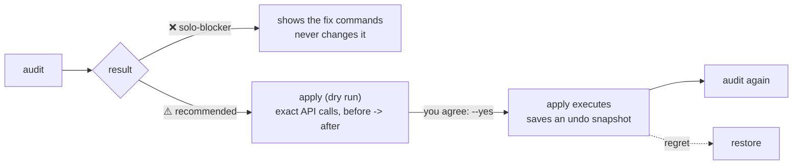

<p align="center">
  
</p>

<h1 align="center">github-solo-skill</h1>

<p align="center"><strong>A GitHub settings checkup for one-person repos. It never locks you out of merging your own PRs.</strong></p>

<p align="center">
  Audit · safe auto-setup · free features only · undo with <code>restore</code> · Python standard library<br>
  Claude Code · Codex · Cursor · Copilot · any agent that reads <code>SKILL.md</code> / <code>AGENTS.md</code>, or speaks MCP
</p>

<p align="center">
  <a href="https://github.com/kajisho5/github-solo-skill/actions/workflows/test.yml"></a>
  <a href="https://github.com/kajisho5/github-solo-skill/stargazers"></a>
  <a href="https://github.com/kajisho5/github-solo-skill/commits/main"></a>
  
  
  <a href="https://kajisho5.github.io/github-solo-skill/"></a>
  <a href="LICENSE"></a>
  <a href="https://github.com/sponsors/kajisho5"></a>
</p>

```bash
npx skills add kajisho5/github-solo-skill
```

English · [日本語](README.ja.md) · [Website](https://kajisho5.github.io/github-solo-skill/)

<p align="center"></p>

<p align="center"><sub>Real output against a scratch repo (sections shortened). Ask your agent <em>"check my repo settings"</em>, or run <code>python3 scripts/solo.py audit OWNER/REPO</code>.</sub></p>

## In 30 seconds

```bash
python3 scripts/solo.py audit OWNER/REPO          # 1. what is missing? (exit code 1 only for ❌)
python3 scripts/solo.py apply OWNER/REPO          # 2. what would change? (dry run, nothing is written)
python3 scripts/solo.py apply OWNER/REPO --yes    # 3. do it (invisible, reversible items only)
python3 scripts/solo.py restore OWNER/REPO --yes  # 4. regret it? put it back
```

Public-facing items (Pages, Discussions, topics …) are never applied unless you name them: `apply --yes --only pages`.

## Why this exists

Team-oriented GitHub skills (for example `netresearch/github-project-skill`) switch on branch protection that **requires an approving review**,
often plus CODEOWNERS review and `enforce_admins`. With one maintainer nobody can approve, so **you can no longer merge your own PRs**.

`github-solo` is built on the opposite rule. Here is what it does when it meets such a repo (real output):

<p align="center"></p>

| | Team-oriented skills | github-solo |
|---|---|---|
| Required approvals / CODEOWNERS review / `enforce_admins` | added | **never added**. An existing one on a single-committer repo is flagged ❌ with the commands to remove it, and never changed automatically |
| Protection of the default branch | PR-only | ruleset `solo-guard`: no deletion, no force-push. Direct pushes and your own merges keep working |
| Paid features | assumed | free features only. On private repos the paid ones are shown as ➖ and skipped (see below) |
| What `apply` changes by default | everything | only invisible, instantly reversible items. Public-facing items and anything that can break a workflow need an explicit `--only` |
| Existing files and settings | may be overwritten | never deleted or overwritten |
| Mistakes | fix them by hand | `restore` reverts exactly what the last `apply --yes` changed |

More background: [docs/why-solo.md](docs/why-solo.md).

<p align="center"></p>

## How it works



<p align="center"></p>

## What is checked (31 checks)

Details, the API used and how to undo each one: [references/checks.md](references/checks.md), or `solo.py explain CHECK_ID`.

| Category | Check (apply id) | `apply` |
|---|---|---|
| **Security** | `dependabot-alerts`, `dependabot-security-updates` | default |
| | `secret-scanning`, `push-protection`, `private-vuln-reporting`, `codeql` (public repos) | default |
| | `dependabot-config`: generates `.github/dependabot.yml` from the detected ecosystems (monthly, one grouped PR each); an existing file is only compared | default |
| | `actions-pinning`: workflow actions pinned to a commit SHA | report only |
| | `actions-hardening`: workflows without `permissions:`, `pull_request_target` checking out PR code, untrusted values expanded in `run:` (text heuristic) | report only |
| | `actions-can-create-prs`: release-please / create-pull-request fail when Actions may not create PRs | **opt-in** |
| | `open-alerts`: open Dependabot alerts by severity | report only |
| | `workflow-permissions`: default `GITHUB_TOKEN` read-only | **opt-in** |
| **Solo development** | `solo-blocker`: approval-required rules that lock out a one-person repo | ❌ detect only |
| | `guardrail`: ruleset `solo-guard` (no delete / force-push of the default branch, no PR requirement) | default |
| | `tag-guard`: ruleset `solo-tag-guard` for `v*` tags | **opt-in** |
| | `delete-branch-on-merge` | default |
| | `discussions` | **opt-in** |
| **Distribution** | `pages` (folder auto-detected, homepage filled in) | **opt-in** |
| | `releases`: any release, a "latest" with downloadable assets, asset names without versions | report only |
| | `release-workflow`: a push to the default branch may create a release | report only |
| | `ci-status`: the latest run of each workflow on the default branch passed | report only |
| | `release-tag-format`: the newest tag is a plain `vX.Y.Z` (release-please adds the package name by default) | report only |
| | `release-notes-config`: `.github/release.yml` | default |
| **Metadata** | `security-policy`: `SECURITY.md` pointing to private vulnerability reporting | default |
| | `description`, `license` (never generated), `social-preview` (no API), `issues-enabled` | report only |
| | `topics` (`--topics a,b`), `labels` (for `release.yml`), `community-files` (issue / PR templates, CONTRIBUTING) | **opt-in** |

**Private repos:** GitHub Secret Protection / Code Security are paid, so `secret-scanning`, `push-protection`, `private-vuln-reporting` and `codeql` are ➖ with the reason; rulesets need a paid plan too (➖ for `guardrail` / `tag-guard`). Dependabot alerts and updates stay free and are applied.

**"Push may release" warning:** if a workflow runs on pushes to the default branch **and** looks like it creates releases (`gh release create`, `softprops/action-gh-release`, `release-please`, `contents: write` …, also through called reusable workflows), `apply` warns before it writes files, and `--commit-files` is refused unless you add `--accept-release-risk`. Detection is a text heuristic.

## Commands

| Command | What it does |
|---|---|
| `audit [OWNER/REPO] [--json] [--quiet] [--ignore ids] [--fail-on warn] [--profile app\|library\|site\|docs] [--github-annotations]` | diagnose; exit 1 if any ❌ (`--fail-on warn`: also on ⚠️). Prints a 0-100 score |
| `audit --all-repos OWNER [--json]` | one line per non-archived, non-fork repo of an owner |
| `apply [OWNER/REPO] [--yes] [--only ids] [--skip ids] [--pages-path / \| /docs] [--topics a,b] [--commit-files] [--accept-release-risk] [--json]` | dry-run plan; `--yes` executes |
| `restore [OWNER/REPO] [--yes] [--snapshot FILE]` | revert what the last `apply --yes` changed |
| `doctor [OWNER/REPO] [--json]` | where it runs (cloud container / Claude Code on your machine / plain shell), token source (never printed), API reachability, your access to each admin endpoint |
| `links [OWNER/REPO] [--markdown]` | stable `/releases/latest/download/<asset>` URLs, or why none can work (only pre-releases, version in the asset name) |
| `links --workflow` | a release workflow template that uploads version-less asset copies |
| `dependabot [OWNER/REPO]` | print a generated `dependabot.yml` |
| `badges [OWNER/REPO]` | README badge Markdown |
| `explain CHECK_ID` | why / API / how to undo one check (offline) |
| `ci-template` | a weekly audit GitHub Actions workflow |

`OWNER/REPO` may be omitted inside a clone (read from `git remote origin`). `--lang ja` (or `SOLO_LANG=ja`, or a Japanese `$LANG`) translates the text output; `--json` is always English.
On GitHub Enterprise Server set `SOLO_API_BASE=https://HOST/api/v3`. More examples: [docs/recipes.md](docs/recipes.md).

### Generated files

`dependabot.yml`, `release.yml`, `SECURITY.md` and the community files are created only if missing: written **locally inside a clone** (you review and commit them), or with `--commit-files` committed straight to the default branch through the Contents API. Existing files are never touched.

## Token permissions

The token comes from `GH_TOKEN`, then `GITHUB_TOKEN`, then `gh auth token`.

- **Classic PAT:** `repo` (for public repos only, `public_repo` covers the code-scanning endpoint; the other admin endpoints are documented against `repo`).
- **Fine-grained PAT**, repository permissions (from the [GitHub docs](https://docs.github.com/en/rest/authentication/permissions-required-for-fine-grained-personal-access-tokens); not measured per endpoint):

| Permission | Level | For |
|---|---|---|
| Metadata | Read | repo info, collaborators |
| Administration | Read and write | Dependabot, private vulnerability reporting, code scanning, rulesets, branch protection (read), Actions workflow permissions, repo settings (`PATCH`) |
| Contents | Read (audit) / Read and write (`--commit-files`) | git tree, file contents, committing generated files |
| Pages | Read and write | `--only pages` |

You must be an admin of the repo for most settings. 403/404 and plan limits: [references/troubleshooting.md](references/troubleshooting.md). Run `solo.py doctor OWNER/REPO` first when something fails.

## Install

```bash
# Skills CLI (Claude Code, Cursor, Codex, ...)
npx skills add kajisho5/github-solo-skill

# or clone into your agent's skills directory
git clone https://github.com/kajisho5/github-solo-skill ~/.claude/skills/github-solo   # Claude Code
git clone https://github.com/kajisho5/github-solo-skill ~/.cursor/skills/github-solo   # Cursor
git clone https://github.com/kajisho5/github-solo-skill ~/.agents/skills/github-solo   # Codex (Cursor reads this too)
```

### Other AI agents (Codex, Cursor, Copilot, Gemini CLI, ...)

| Agent | How |
|---|---|
| **Codex** | skills: clone into `~/.agents/skills/github-solo` (user) or `<repo>/.agents/skills/github-solo` (repo), per the [Codex skills docs](https://learn.chatgpt.com/docs/build-skills). MCP: `codex mcp add github-solo -- python3 /path/to/github-solo/scripts/solo_mcp.py` or a `[mcp_servers.github-solo]` table (`command`, `args`) in `~/.codex/config.toml` ([docs](https://learn.chatgpt.com/docs/extend/mcp?surface=cli)). Codex also reads `AGENTS.md`. **Codex desktop app (Windows):** *Settings → MCP servers → Add server → STDIO*, command `python`, argument the full path of `scripts\solo_mcp.py` (the app shares `config.toml` with the CLI, per the docs; the docs do not cover Windows paths specifically, and this was not tried in the app). |
| **Claude Code** | skill (above), plugin (below), or MCP: `claude mcp add github-solo -- python3 /path/to/github-solo/scripts/solo_mcp.py` |
| **Cursor** | skills directory `~/.cursor/skills/github-solo` (path as documented by the sibling project [ffmpeg-skill](https://github.com/kajisho5/ffmpeg-skill); Cursor reads `~/.agents/skills` too). Not verified against Cursor's own docs. |
| **GitHub Copilot** | reads `AGENTS.md` and `.github/copilot-instructions.md` in this repo ([docs](https://docs.github.com/en/copilot/how-tos/configure-custom-instructions/add-repository-instructions)). |
| **Any other agent** | MCP stdio server `python3 scripts/solo_mcp.py` (tools: `solo_doctor`, `solo_audit`, `solo_apply_plan`, `solo_apply`, `solo_restore`, `solo_links`, `solo_dependabot`, `solo_badges`, `solo_explain`), or just run `python3 scripts/solo.py ...`; point the agent at `AGENTS.md`. |

The MCP server follows the [MCP stdio transport](https://modelcontextprotocol.io/specification/2025-06-18/basic/transports) (newline-delimited JSON-RPC, protocol versions 2025-06-18 / 2025-03-26 / 2024-11-05) and was tested with a hand-written client and with Claude Code's own client (`claude mcp list` reports it connected); Codex and Cursor have not been tried. `solo_apply` and `solo_restore` change nothing unless `confirm` is `true`.

As a Claude Code plugin (marketplace hosted in this repo):

```bash
claude plugin marketplace add kajisho5/github-solo-skill
claude plugin install github-solo@github-solo-skill
```

Without any agent: `python3 scripts/solo.py --help`. Update a clone with `git pull`; copies made by other installers are not updated automatically. On Windows use `python` if `python3` is not on your PATH.

## How well is it tested?

- **65 unit tests, no network.** A mock GitHub API server runs in-process; each scenario asserts the audit verdicts, the dry-run plan and the exact write requests (method, path, body). They run in CI on Python 3.9 and 3.13 (Linux) and 3.13 (Windows).
- **Against the real GitHub API** (a public scratch repo, run from Windows): every item below was applied and reverted, and a before/after audit of all 25 checks was identical.
  `codeql`, `delete-branch-on-merge`, `dependabot-alerts`, `dependabot-security-updates`, `discussions`, `guardrail`, `labels`, `pages`, `private-vuln-reporting`, `tag-guard`, `topics`,
  `secret-scanning`, `push-protection`, `workflow-permissions`; `solo-blocker` through classic branch protection **and** through a ruleset (flagged, exit code 1, never changed);
  generated files written locally and committed with `--commit-files`; `dependabot.yml` generated from real manifests; a private repo on the free plan (paid items ➖, nothing paid planned).
- **Not tried live:** organization-owned repos, GitHub Enterprise Server, the `--commit-files` release guard on a repo that really has a release-on-push workflow, fine-grained tokens per endpoint. Full list: [ROADMAP.md](ROADMAP.md).

## Requirements

- Python 3.9+ (standard library only), `git` (only to infer `OWNER/REPO` and detect a clone), optionally `gh` (only as a token source).
- A GitHub token with the permissions above.

## Development

```bash
python -m unittest           # all tests, no network
python -m unittest tests.test_solo.VoiceboothScenario -v

# against the real API, on a disposable repo you own (changes its settings, then reverts them):
python3 tests/live_check.py YOU/scratch-repo --confirm YOU/scratch-repo

python3 assets/build_assets.py   # rebuild the images (needs Chromium and ffmpeg / ImageMagick)
```

Scenarios live in `tests/test_solo.py` (fixtures in `tests/fixtures.py`, server in `tests/mock_github.py`). See [CONTRIBUTING.md](CONTRIBUTING.md).

**Releasing** is automated with [release-please](https://github.com/googleapis/release-please): merge Conventional Commits (`feat:`, `fix:`, `docs:` …) to `main`, release-please keeps a release PR up to date (version in `plugin.json` and `scripts/solo.py`, changelog), and merging that PR tags and publishes the GitHub Release. **A major version is never bumped automatically**: the project stays on 0.x (`bump-minor-pre-major`), so a breaking change (`feat!:`) bumps the minor; 1.0.0 is a deliberate release (`Release-As: 1.0.0` in a commit footer). The release PR needs *Settings → Actions → General → "Allow GitHub Actions to create and approve pull requests"* enabled.

## Docs

| | |
|---|---|
| [SKILL.md](SKILL.md) / [AGENTS.md](AGENTS.md) | what the agent reads: workflow and rules |
| [docs/why-solo.md](docs/why-solo.md) | the one-person lock-in problem, and the design rules that follow |
| [docs/recipes.md](docs/recipes.md) | CI, many repos, stable download links, MCP, Windows tips |
| [docs/faq.md](docs/faq.md) | questions people ask |
| [references/checks.md](references/checks.md) | every check: reason, API, revert |
| [references/release-latest.md](references/release-latest.md) | stable latest-release links, pre-releases, version-less asset names |
| [references/troubleshooting.md](references/troubleshooting.md) | 403 errors, scopes, private repo paid features |
| [ROADMAP.md](ROADMAP.md) | what is done, what is still unverified, what is out of scope |
| [CONTRIBUTING.md](CONTRIBUTING.md) · [SECURITY.md](SECURITY.md) | contributing · reporting a vulnerability |

## Support

If this saves you time, you can help keep it maintained through [GitHub Sponsors](https://github.com/sponsors/kajisho5). Issues and pull requests are welcome.

## License

[MIT](LICENSE)
